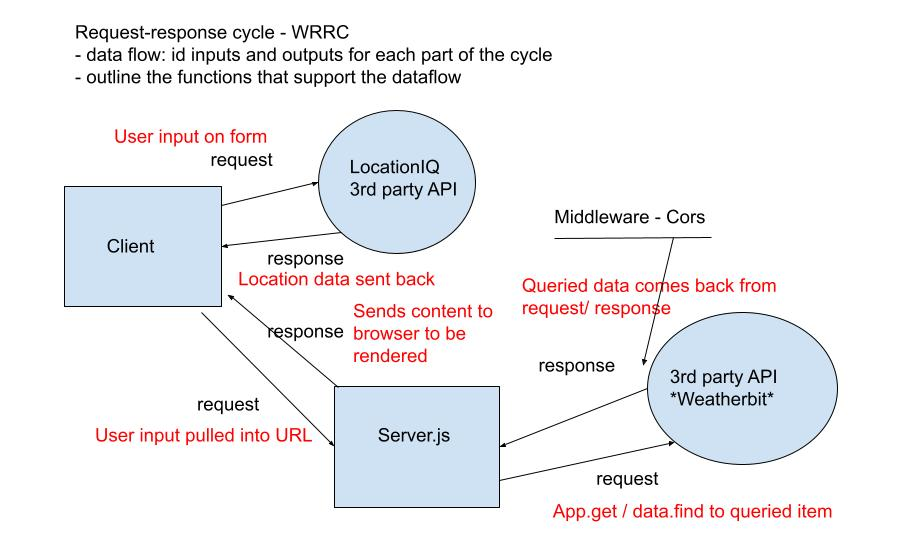

# City Explorer API

**Author**: Dasha Burgos

**Version**: 1.0.0
<!-- (increment the patch/fix version number if you make more commits past your first submission) -->

## Overview
<!-- Provide a high level overview of what this application is and why you are building it, beyond the fact that it's an assignment for this class. (i.e. What's your problem domain?) -->

## Getting Started
<!-- What are the steps that a user must take in order to build this app on their own machine and get it running? -->

## Architecture

<!-- Provide a detailed description of the application design. What technologies (languages, libraries, etc) you're using, and any other relevant design information. -->

WRRC

## Change Log
<!-- Use this area to document the iterative changes made to your application as each feature is successfully implemented. Use time stamps. Here's an example:

01-01-2001 4:59pm - Application now has a fully-functional express server, with a GET route for the location resource. -->

## Credit and Collaborations

Audrey 

## Time Estimates

### Feature #1: Weather Live

Estimate of time needed to complete: 2 hours

Start time: 2200

Finish time: 2330

Actual time needed to complete: 1 hour 30 min

## Feature #2: Movies

Estimate of time needed to complete: _____

Start time: _____

Finish time: _____

Actual time needed to complete: _____

## Feature #3: Publish

Estimate of time needed to complete: _____

Start time: _____

Finish time: _____

Actual time needed to complete: _____